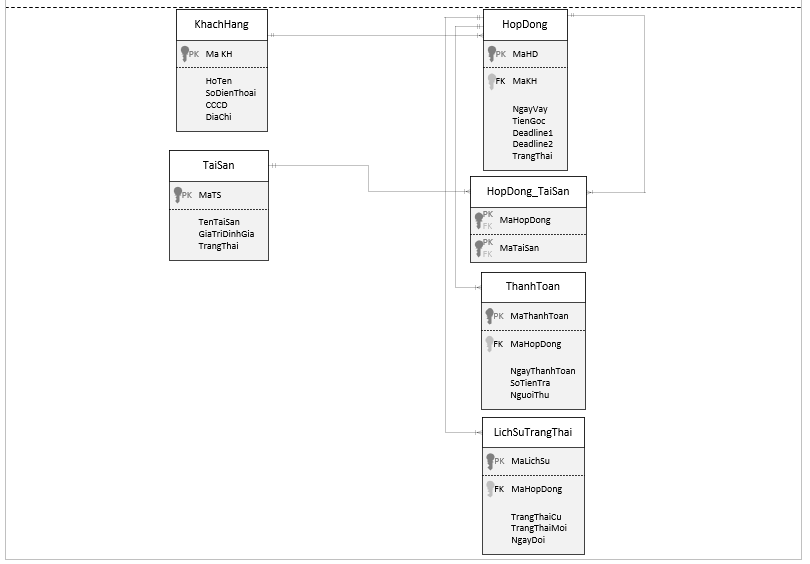
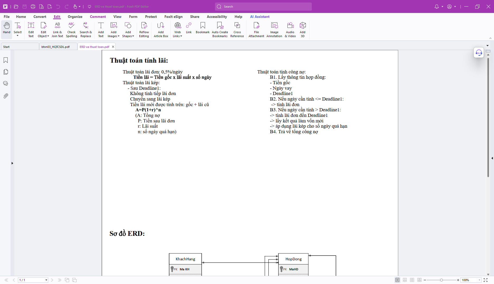
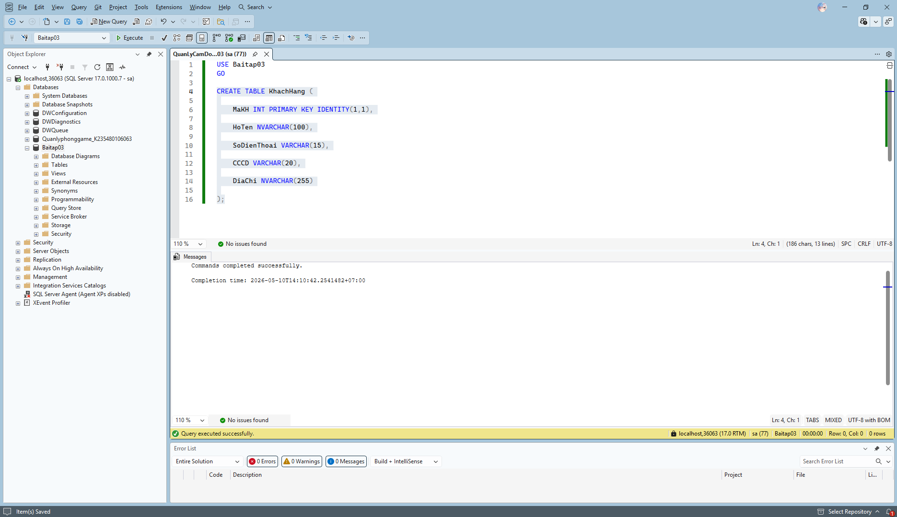

# Remu_SQL_3
Bài tập về nhà 03: THIẾT KẾ VÀ CÀI ĐẶT CSDL QUẢN LÝ CẦM ĐỒ

1.Xây dựng sơ đồ ERD trên Microsoft Visio

2.Export PDF của file Visio và mô tả thuật toán

3.Mở SQL, tạo database, tạo bảng KhachHang

