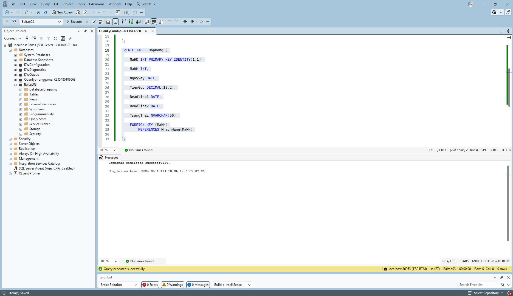
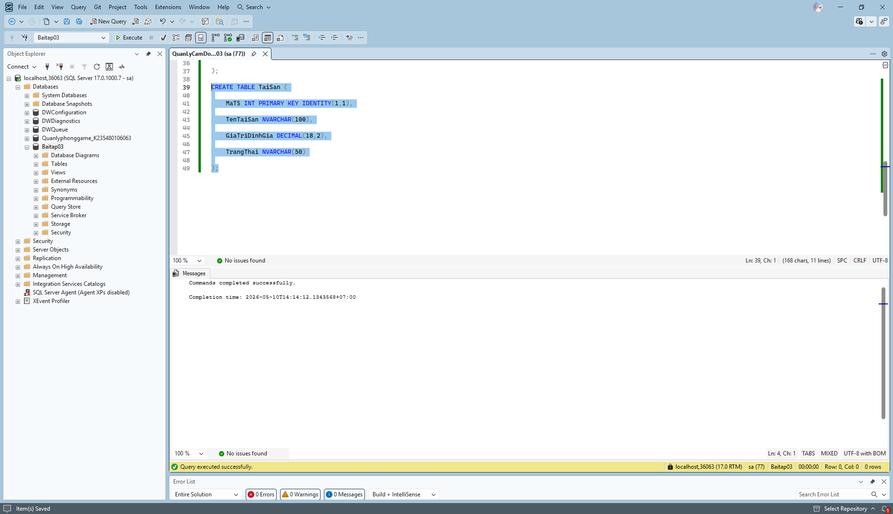
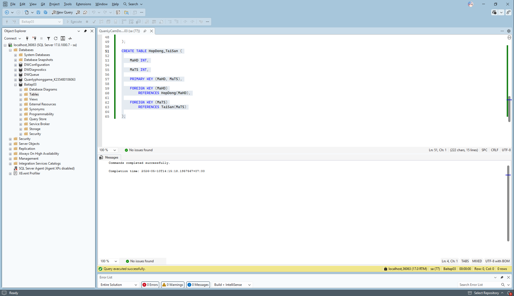
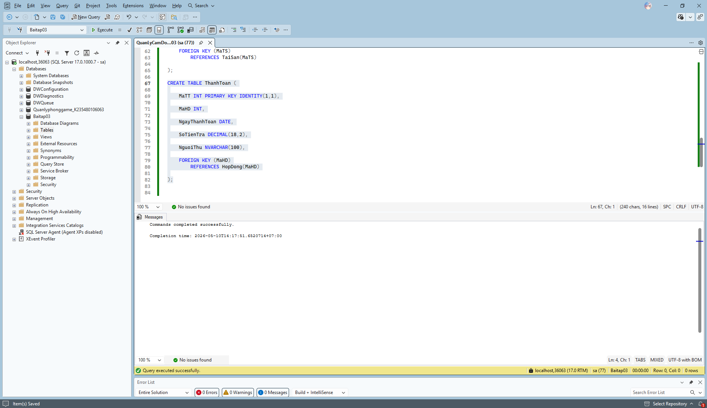
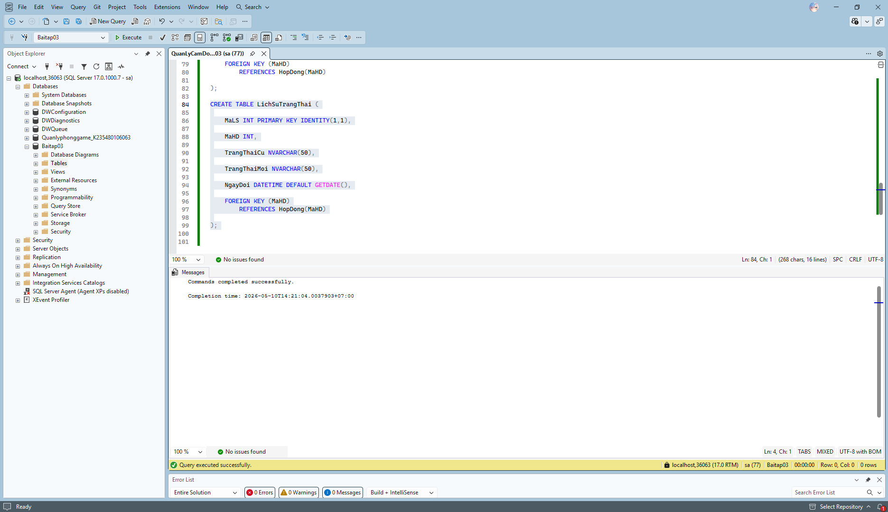
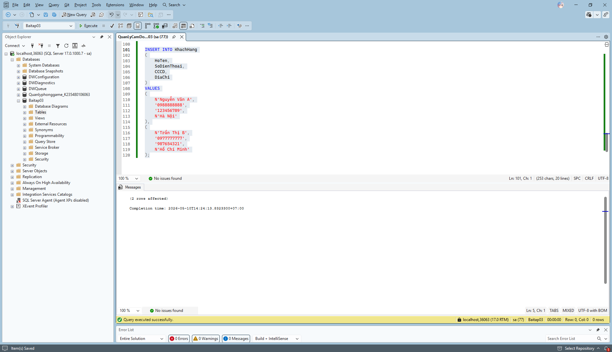
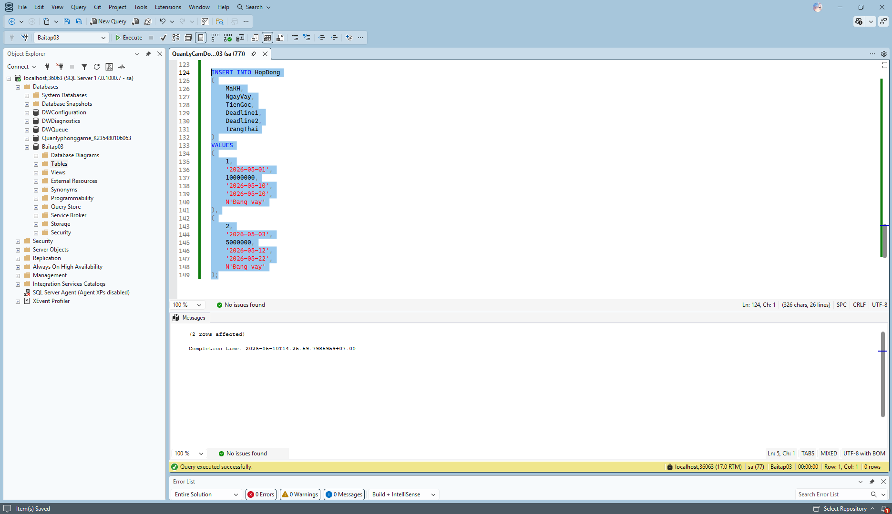
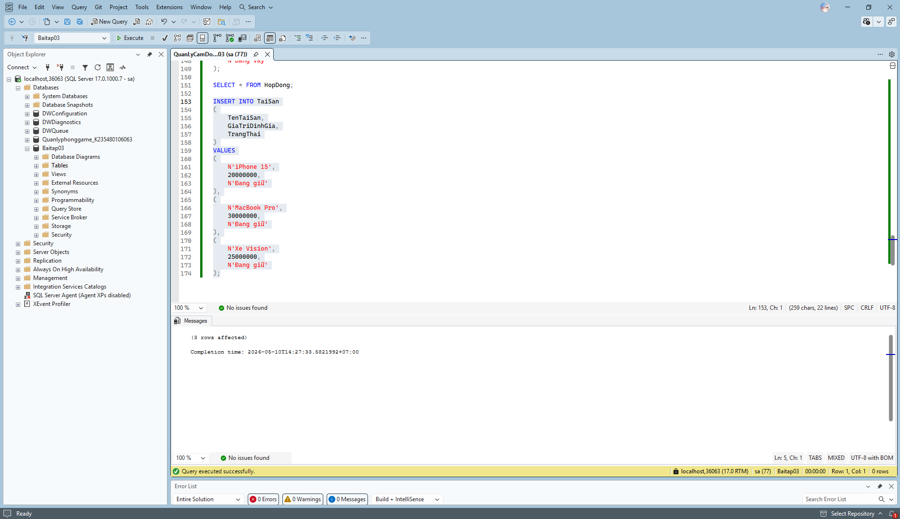
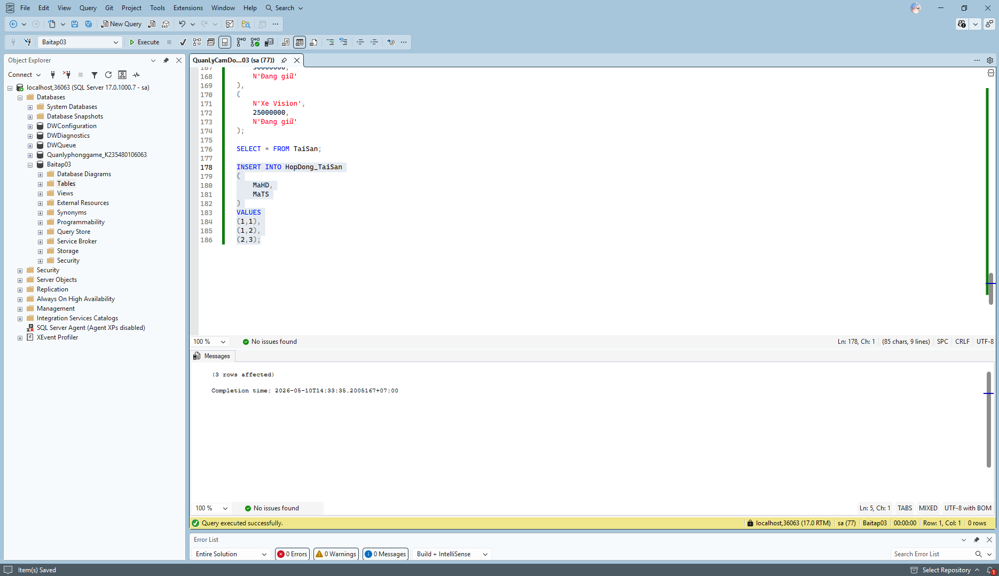
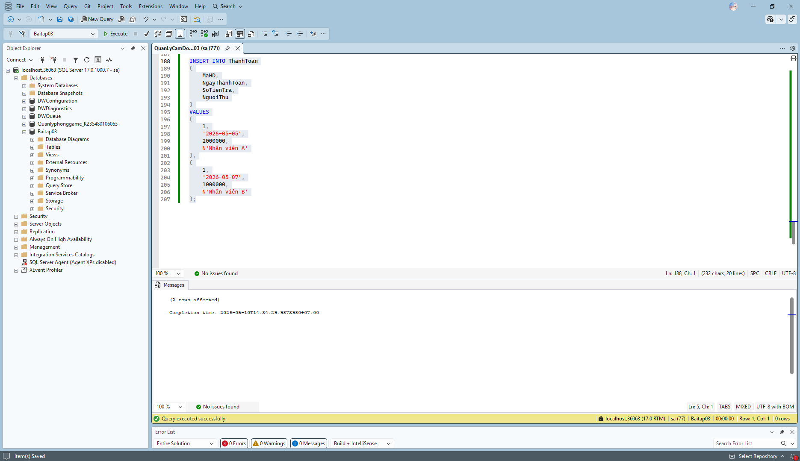

# Remu_SQL_3
Bài tập về nhà 03: THIẾT KẾ VÀ CÀI ĐẶT CSDL QUẢN LÝ CẦM ĐỒ

1.Xây dựng sơ đồ ERD trên Microsoft Visio

2.Export PDF của file Visio và mô tả thuật toán

3.Mở SQL, tạo database, tạo bảng KhachHang

4.Tạo bảng HopDong

5.Tạo bảng TaiSan

6.Tạo bảng HopDong_TaiSan

7.Tạo bảng ThanhToan

8.Tạo bảng LichSuTrangThai

9.Insert bảng KhachHang

10.Insert bảng HopDong

11.Insert bảng TaiSan

12.Insert bảng HopDong_TaiSan

13.Insert bảng ThanhToan

